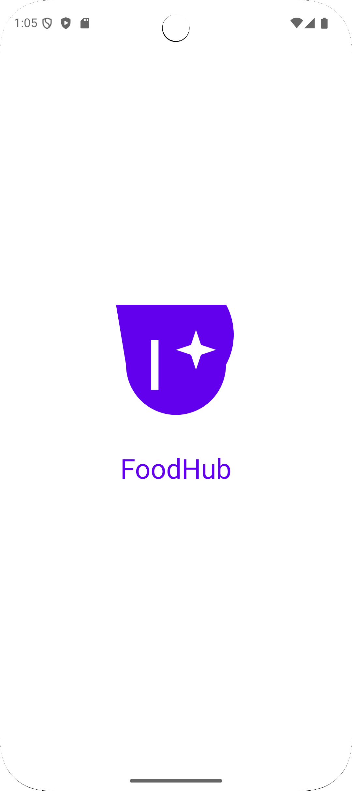
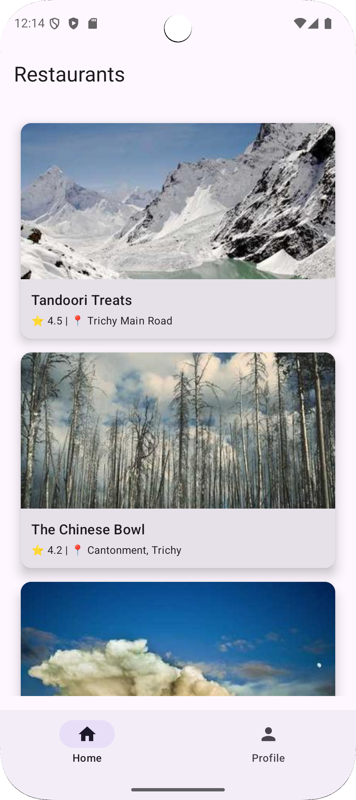
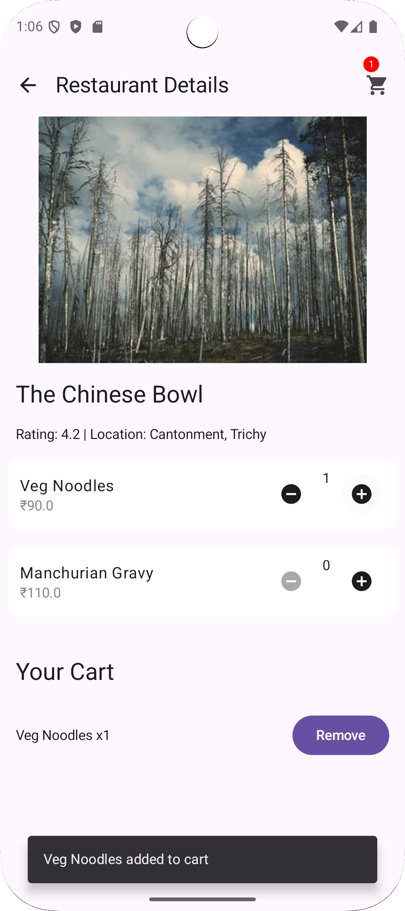
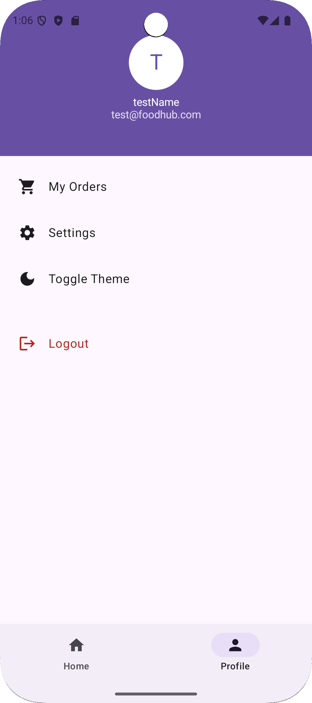

# 🍔 FoodHub App

FoodHub is a modern food ordering Android application built with Kotlin, Jetpack Compose, and MVVM architecture.

The app is currently under active development, and more features and UI improvements are coming soon! 🚀

---

## 🔐 Demo Login Details

To log in and test the app, use these demo credentials on the login screen:

- **Email:** `test@foodhub.com`  
- **Password:** `123456`

> 💡 This is a static demo login. Firebase Email/Password registration is **not yet implemented**.

---

## 🍽 Demo Restaurant Data

By default, the app fetches restaurant data using a Mocky.io URL.

⚠️ **Note:** The Mocky.io link expires after 7 days. If it's expired, the app won't load data.

To fix this:

1. Open the `assets/restaurants.json` file — this is the sample data.
2. Go to [https://mocky.io](https://mocky.io) and paste the JSON content.
3. Create a new Mocky link.
4. Replace the URL inside the code (usually in the Repository or Retrofit API).

> This lets you keep testing the app with your own fresh mock data link.

---

## ✨ Features Completed

- 🔥 Splash Screen with Logo Animation  
- 🔑 Login Screen with DataStore to save login state  
  ➕ Google Sign-In using Firebase Authentication  
- 🏠 Home Screen displaying restaurants and food items  
- 🍽️ Details Screen for individual restaurant/food  
- 👤 Profile Screen with Logout  
- 🛒 Add to Cart using Room Database  
- 🍟 SnackBar messages for quick feedback  
- 🔄 Swipe-to-Refresh to reload data  
- 📡 API Integration with Retrofit  
- 📦 Hilt and Dagger for Dependency Injection  
- 🚀 MVVM Architecture  
- 🔻 Bottom Navigation for smooth experience  

---

## 🛠️ Tech Stack

- Kotlin  
- Jetpack Compose  
- MVVM Architecture  
- Hilt / Dagger  
- Retrofit  
- Room Database  
- DataStore  

---

## 🚀 What's Coming Next?

- 🛍️ Order Summary Page  
- 🛒 Checkout and Order Placement  
- 🎨 Full Theme and UI Enhancements  
- 🔍 Search Functionality  
- 🗂️ Categories and Banners  
- 🏷️ Discount Offers  
- 📦 Clean State Management  
- 💬 Improved User Experience with Animations  

---

## 📸 Screenshots

<table>
  <tr>
    <td align="center"></td>
    <td align="center"></td>
    <td align="center"></td>
    <td align="center"></td>
    <td align="center"></td>
  </tr>
  <tr>
    <td align="center">Splash</td>
    <td align="center">Login</td>
    <td align="center">Home</td>
    <td align="center">Details</td>
    <td align="center">Profile</td>
  </tr>
</table>

---

## 📢 Note

This project is still a **work-in-progress**.  
More screens, features, and performance updates are coming soon. Stay tuned! 🎯

---

## 🙌 Thank You for Visiting!
